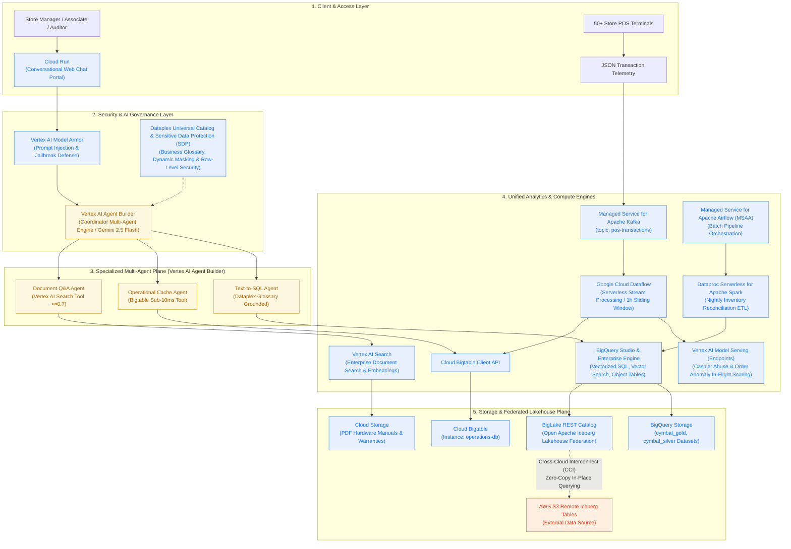
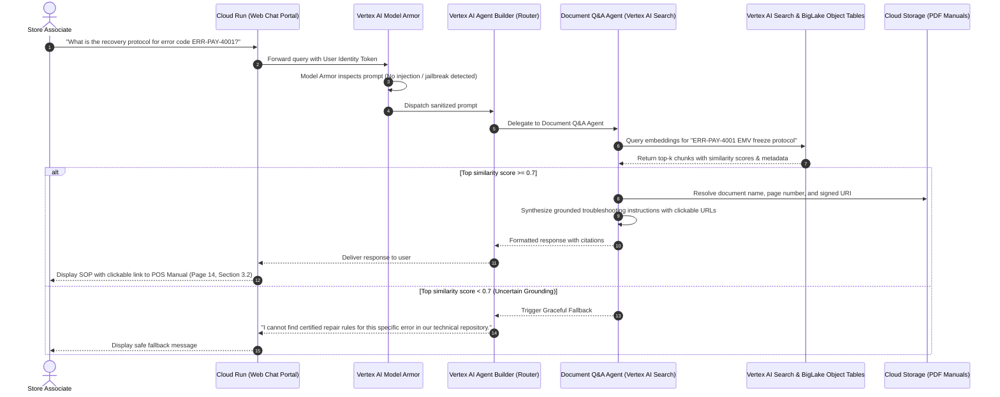
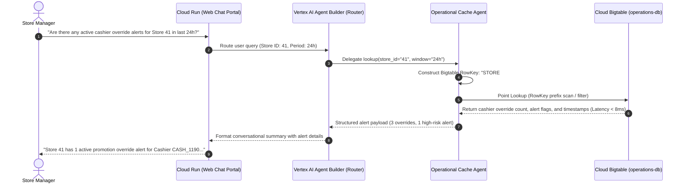
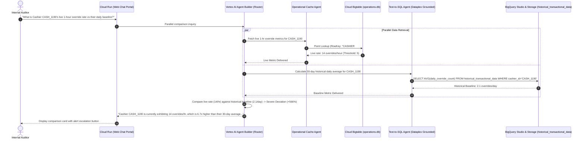
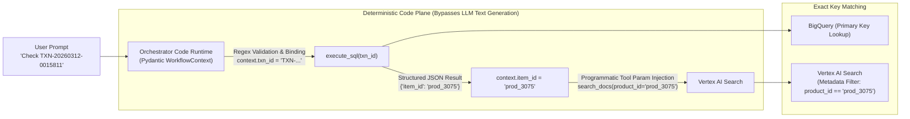

# **SOLUTION DESIGN DOCUMENT (SDD)**

# **Document Control**

## **Document Metadata**

| Field | Value |
| :---- | :---- |
| Project Name | Cymbal Retail — Agentic AI & Data Platform Modernization |
| Author(s) | Luke Lee (lukekflee@) / Google Cloud Solution Architecture Team |
| Date | 2026-09-08 |
| Status | Approved / Ready for Implementation |
| Target Audience | Evaluation Committee, Lead Architects, Technical Review Board |
| Target GCP Project | `eco-emissary-356802` |

## **Revision History**

| Version | Date | Author | Description of Change |
| :---- | :---- | :---- | :---- |
| 0.1 | 2026-09-08 | Luke Lee | Initial solution design outline & requirement decomposition |
| 1.0 | 2026-09-08 | Luke Lee | Complete end-to-end architecture, sequence diagrams, tool contracts, governance & FinOps |

---

# **1. Problem Statement & Scope Boundaries**

## **1.1. Problem Statement**

### **What problem are we solving?**
Cymbal Retail operates 500+ brick-and-mortar storefronts alongside a global e-commerce platform. Their legacy data infrastructure runs on AWS and Databricks. They face critical operational and financial bottlenecks:
1. **High Cross-Cloud Egress Costs**: Fragmented datasets across AWS S3 and GCP lead to recurring, unpredictable data transfer egress charges when piping data between analytical tools.
2. **Spark Infrastructure Overhead**: Fixed, persistent Databricks Spark clusters incur significant idle compute costs during non-peak hours ($0-cluster tax non-existent).
3. **24-Hour Batch Reporting Latency**: Nightly batch runs create 24-hour operational blind spots, preventing timely detection of POS cashier promotion override abuse and order anomalies.
4. **Dark Unstructured Data**: Crucial POS hardware troubleshooting guides and warranty documents exist as stranded PDFs in object storage, forcing manual, error-prone store-floor support.
5. **Lack of Multimodal Agentic Capabilities**: No unified conversational interface exists to allow store managers and planners to query structured metrics, real-time alerts, and technical documents in natural language.

### **Who is affected?**
* **Store Managers & Cashier Supervisors**: Require instant visibility into intraday revenue, stock cover hours, and real-time cashier promotion override flags.
* **Shop-Floor Associates**: Require rapid, citation-grounded troubleshooting steps for frozen or malfunctioning POS terminals.
* **Supply Chain & Inventory Planners**: Need real-time inventory reconciliation and supply chain defect traceability.
* **Enterprise Security & Compliance Officers**: Must ensure customer payment card numbers (PCI-DSS) are never leaked in LLM prompts or chat logs.

### **What is the impact?**
* Financial loss due to undetected checkout promotion fraud and cashier shrink.
* Increased customer checkout wait times when POS terminals freeze or fail.
* Inflated cloud infrastructure TCO caused by redundant cross-cloud data copies and idle compute.
* Potential regulatory penalties if unmasked PII/PCI data appears in conversational audit trails.

### **Why now?**
With Google Cloud’s **Agentic Data Cloud**, open Apache Iceberg federation, Serverless Spark, and Gemini-native AI agent platforms, Cymbal Retail can leapfrog traditional brittle ETL pipelines. They can establish an AI-native system of action that delivers zero-copy analytics, sub-second operational lookups, and grounded conversational agents.

---

## **1.2. Scope Boundaries**

### ***In Scope for Solution***
* **Data Foundations & Lakehouse**: Cross-cloud zero-copy federation to AWS S3 Iceberg tables via BigLake REST Catalog (`cymbal-lakehouse`), Dataproc Serverless Spark batch ETL, GCS unstructured document repository, and central metadata governance via Dataplex.
* **Real-Time Operations & Streaming**: High-throughput POS transaction ingestion via Google Managed Kafka (`kafka-cluster`), stream processing with sliding-window cashier aggregations, low-latency operational caching via Cloud Bigtable (`operations-db`), and Vertex AI real-time anomaly inference endpoints.
* **Agentic Operations Portal**: Web conversational assistant featuring a Coordinator Router Agent with specialized subagents (Text-to-SQL analytics, Bigtable cache lookup, RAG technical manual Q&A) communicating via standardized tool protocols.
* **Security, Governance & Privacy**: Column-level policy tags (`cymbal_pii`) for dynamic PCI-DSS credit card masking (`XXXX-XXXX-XXXX-9999`), store-manager row-level security (RLS), and strict RAG grounding guardrails (similarity threshold ≥ 0.7).

### ***Out of Scope for Solution***
* Direct write-backs to legacy AWS S3 tables or regional store relational databases (read-only federation).
* Multi-lingual conversational support (English only for pilot).
* Telephony (IVR / VoIP) audio interface integration.
* Production enterprise SSO synchronization (Okta / Active Directory); mocked via validated JWT headers and functional GCP service accounts.
* Multi-tenant logical isolation beyond single-tenant project sandboxing.

---

## **1.3. Target Architecture Overview**

The solution architecture integrates three primary planes:
1. **Data Ingestion & Lakehouse Federation Plane**: Ingests real-time events via Managed Kafka and federates external AWS S3 Iceberg datasets without physical data replication.
2. **Analytical & Operational Storage Plane**: Combines BigQuery (vectorized analytics & object tables), Cloud Bigtable (sub-10ms operational cache), and GCS (unstructured documents).
3. **Agentic Orchestration & AI Inference Plane**: A multi-agent framework powered by Gemini, coordinated via an Agent Gateway with strict policy guardrails and tool contracts.



### **Component Descriptions (Google Cloud Native Architecture)**

| Component Category | Modern Google Cloud Service | Role & Responsibility | Key Interface / Protocol |
| :--- | :--- | :--- | :--- |
| **Front-End & Runtime** | **Cloud Run** | Serverless hosting for the multi-turn conversational web chat portal (React / Streamlit). | HTTPS / WebSockets, OIDC / JWT |
| **AI Security Gateway** | **Vertex AI Model Armor** | Inspects user prompts & model responses for prompt injection, jailbreaking, toxicity, and sensitive data leakage. | Vertex AI Model Armor API |
| **Agent Orchestrator** | **Vertex AI Agent Builder** | Coordinates multi-agent reasoning, intent routing, and tool invocation using **Gemini 2.5 Flash**. | Vertex AI Reasoning Engine / Extensions API |
| **Document Search (RAG)** | **Vertex AI Search** | Managed document chunking, vector indexing, and grounded retrieval over GCS technical manuals (Threshold ≥ 0.7). | Vertex AI Search API / Discovery Engine |
| **Data Governance & Catalog** | **Dataplex Universal Catalog** | Centralized metadata management, business glossaries (`certified=true`), schema lineage, and policy tags. | Dataplex API, GoogleSQL Policy Tags |
| **Data Privacy & Redaction** | **Sensitive Data Protection (SDP)** | Dynamic masking of customer credit card PII (`XXXX-XXXX-XXXX-9999`) and sensitive tokens across all logs and chat turns. | BigQuery Data Policy (`mask_card_number`) |
| **Lakehouse Federation** | **BigLake REST Catalog** | Open Apache Iceberg REST Catalog enabling zero-copy, in-place analytics on remote AWS S3 Iceberg tables over CCI. | Apache Iceberg REST Catalog API, AWS STS AssumeRole |
| **Analytical Query Engine** | **BigQuery Studio & Enterprise Edition** | Vectorized query processing, GoogleSQL analytics, vector indexing, and BigLake Object Tables. | BigQuery Storage Read/Write API, GoogleSQL |
| **Real-Time Event Broker** | **Managed Service for Apache Kafka** | First-party managed event streaming cluster (`kafka-cluster`) ingesting POS telemetry from 50+ stores. | Kafka Protocol (Port 9092, mTLS/VPC) |
| **Stream Processing** | **Google Cloud Dataflow** | Serverless stream processing executing 1-hour sliding-window aggregations on cashier promotion overrides. | Apache Beam Pipeline Engine, Streaming Runner |
| **Operational Cache** | **Cloud Bigtable** | Wide-column NoSQL database (`operations-db`) providing sub-10ms latency point lookups for live cashier risk states. | Bigtable gRPC API, BigQuery Bigtable Federation |
| **Real-Time ML Scoring** | **Vertex AI Model Serving (Endpoints)** | Sub-50ms in-flight scoring for POS transaction order anomalies and cashier promotion abuse behavior. | Vertex AI Online Prediction REST / gRPC API |
| **Batch Orchestration** | **Managed Service for Apache Airflow (MSAA)** | Managed Airflow environment (`cymbal-airflow-env`) orchestrating nightly synchronization and batch pipelines. | Airflow DAGs, Celery / Kubernetes Executor |
| **Batch Compute Engine** | **Dataproc Serverless for Apache Spark** | Containerized, serverless Spark ETL for nightly inventory reconciliation and sales deduplication (scales to $0). | Dataproc Batches API, PySpark / Spark SQL |
| **Unstructured Document Store**| **Cloud Storage (GCS)** | Object repository (`eco-emissary-356802-module1-bucket`) storing raw PDF repair manuals and warranty policies. | Cloud Storage JSON API, BigLake Object Tables |

---

## **1.4. Alternatives Considered**

| Architecture Decision / Area | Alternative Evaluated | Chosen Approach | Rationale & Trade-offs |
| :--- | :--- | :--- | :--- |
| **Multi-Cloud Data Access** | **BigQuery Omni**: Bring compute to AWS by hosting BigQuery compute clusters in AWS. | **Cross-Cloud Lakehouse Federation**: Centralized GCP compute querying remote AWS S3 Iceberg tables over CCI. | **Why Chosen**: BigQuery Omni cannot natively leverage Google’s cutting-edge AI features (Gemini, vector indexing, geospatial, BQML). Lakehouse Federation centralizes compute in GCP, enabling 100% feature parity while slashing egress costs by up to 80% using private Cross-Cloud Interconnect and intelligent caching. |
| **Batch Normalization Compute** | **Persistent Databricks/Spark Clusters**: Keeping provisioned clusters running 24/7. | **Dataproc Serverless for Apache Spark**: Event-triggered, containerized batch execution. | **Why Chosen**: Eliminates the "idle cluster tax" by scaling compute down to $0 when no batch jobs are running; auto-terminates within 60 seconds of job completion. |
| **Operational Cache Storage** | **Relational PostgreSQL (Cloud SQL)**: Storing streaming sliding-window aggregations in relational tables. | **Cloud Bigtable (`operations-db`)**: Wide-column NoSQL database with custom row-key indexing. | **Why Chosen**: Bigtable provides guaranteed single-digit millisecond latency (P95 < 10ms) for high-throughput point lookups (e.g., `CASHIER#<id>#<date>`), handling massive scale without connection pooling limits. |
| **Document Search Engine** | **External ElasticSearch Cluster**: Managing a self-hosted vector database cluster. | **BigQuery Object Tables + Vertex AI Search**: Managed vector embeddings directly over GCS PDF files. | **Why Chosen**: Eliminates operational overhead of running search clusters; enables unified SQL joins between structured transaction tables and unstructured document chunks. |

---

# **2. Production-Ready Future State Design**

As Cymbal Retail scales from the 50-store pilot to all 500+ physical stores and the global e-commerce platform:
1. **Multi-Region High Availability**:
   * BigQuery Cross-Region Replication guarantees active-passive disaster recovery across `us-central1` and `us-east4`.
   * Cloud Bigtable configured with multi-cluster replication across two availability zones for 99.999% SLA.
2. **Horizontal Elasticity**:
   * Managed Kafka partitions scale dynamically from 5 to 50 partitions to ingest up to 25,000 transactions/sec during Black Friday peaks.
   * BigQuery Enterprise Reservations utilize dynamic Autoscaling Slots, scaling from 0 to 2,000 slots without human intervention.
3. **Observability & Health Telemetry**:
   * All agent turns, SQL translation traces, and vector similarity scores export directly to Cloud Logging and Cloud Trace.
   * Alerts configure in Cloud Monitoring for any P95 conversational latency exceeding 6 seconds or ML inference error rates exceeding 0.1%.

---

# **3. System Flows, Sequence Diagrams & Agent Design**

## **3.1. Sequence Diagram 1: Single-Domain RAG POS Troubleshooting (UC-1.1)**
Demonstrates prompt grounding, vector search, similarity threshold guardrails, and clickable citation generation.



---

## **3.2. Sequence Diagram 2: Single-Domain Real-Time Cache Lookup (UC-1.3)**
Demonstrates single-digit millisecond point lookups against Cloud Bigtable.



---

## **3.3. Sequence Diagram 3: Multi-Domain Warranty Triage (UC-2.1)**
Demonstrates multi-system orchestration across historical relational tables (BigQuery) and unstructured warranty documentation (RAG).

```mermaid
sequenceDiagram
    autonumber
    actor Associate as Customer Service Associate
    participant UI as Cloud Run (Web Chat Portal)
    participant Router as Vertex AI Agent Builder (Router)
    participant SQLAgent as Text-to-SQL Agent (Dataplex Grounded)
    participant BQ as BigQuery Studio & Storage (cymbal_gold)
    participant RAGAgent as Document Q&A Agent (Vertex AI Search)
    participant VectorDB as Vertex AI Search & BigLake Object Tables

    Associate->>UI: "Customer CUST_02598 bought an item with Gift Card. Is it covered under warranty?"
    UI->>Router: Multi-domain warranty triage request
    
    rect rgb(235, 245, 255)
        note over Router,BQ: Step 1: Historical Sales Resolution
        Router->>SQLAgent: Find purchase details for CUST_02598
        SQLAgent->>BQ: SELECT item_id, purchase_date, payment_type FROM historical_transactional_data WHERE customer_id='CUST_02598'
        BQ-->>SQLAgent: Return Item: prod_3075 (Headphones), Date: 2026-02-10, Payment: GIFT_CARD
        SQLAgent-->>Router: Purchase Context Resolved
    end

    rect rgb(255, 248, 230)
        note over Router,VectorDB: Step 2: Unstructured Warranty Coverage Lookup
        Router->>RAGAgent: Query warranty rules for prod_3075 with Gift Card purchase
        RAGAgent->>VectorDB: Search warranty chunks for "Headphones warranty gift card coverage policy"
        VectorDB-->>RAGAgent: Return Warranty Policy Chunk (Score 0.88, 1-year coverage valid for all payment methods)
        RAGAgent-->>Router: Warranty Clause Resolved
    end

    Router->>Router: Synthesize multi-domain verdict (Purchase is within 1 year; Gift Card is fully covered)
    Router-->>UI: "Yes, the product (prod_3075) purchased on Feb 10, 2026 is fully covered under the 1-year warranty..."
    UI-->>Associate: Display synthesis with warranty document link
```

---

## **3.4. Sequence Diagram 4: Multi-Domain Cashier Risk vs. Nightly Audit (UC-2.2)**
Demonstrates parallel execution across real-time Bigtable cache and BigQuery historical baselines.



---

# **4. Data Platform Architecture, Security & Governance**

## **4.1. Entity Definitions & Storage Schema**

### **BigQuery Datasets & Tables**
* **`cymbal_gold.historical_transactional_data`**:
  * Partitioned by `DAY(business_date)`, clustered by `transaction_id`, `store_id`, `customer_id`.
  * Schema: `transaction_id` (STRING), `store_id` (STRING), `cashier_id` (STRING), `customer_id` (STRING), `item_id` (STRING), `gross_amount` (NUMERIC), `card_number` (STRING, Policy Tagged), `override_flag` (BOOLEAN), `business_date` (DATE).
* **`cymbal_gold.gold_inventory_reconciliation_ledger`**:
  * BigLake Iceberg Managed Table backed by Parquet files on GCS (`eco-emissary-356802-module1-bucket/gold_inventory_reconciliation_ledger/`).
  * Schema: `store_id` (STRING), `item_id` (STRING), `physical_inventory_count` (INT64), `system_inventory_count` (INT64), `variance_amount` (NUMERIC), `reconciliation_status` (STRING).
* **`cymbal-lakehouse` (BigLake Federated Catalog)**:
  * Open REST Catalog connected to AWS Glue / S3. Contains Silver conformed fact tables (`sales_orders`, `customer_dimension`, `product_catalog`).

### **Cloud Bigtable (`operations-db`) Schema**
* **Table**: `pos_operational_cache`
* **Column Family**: `cf_metrics` (Max Versions: 1, TTL: 7 days).
* **Row Key Structure**:
  * Store Aggregation: `STORE#<store_id>#<YYYYMMDD>`
  * Cashier Aggregation: `CASHIER#<cashier_id>#<YYYYMMDDHH>`
* **Column Qualifiers**: `override_count_1h`, `anomaly_score`, `last_transaction_ts`, `alert_status`.

---

## **4.2. Security, Privacy & Data Governance**

1. **Role-Based & Row-Level Access Control (RLS)**:
   * Delegated User Identity Tokens pass via gRPC / HTTP headers (`X-Goog-Authenticated-User-Email`).
   * Row-level security filters applied automatically: Store Managers can only query records where `store_id = SESSION_USER_STORE_ID()`.
2. **PCI-DSS Dynamic Data Masking**:
   * Column-level policy tag `projects/eco-emissary-356802/locations/us-central1/taxonomies/.../categories/cymbal_pii` attached to `card_number`.
   * Unauthorized personas (Store Managers, Sales Associates, LLM Tool Prompts) execute via custom routine `mask_card_number`, receiving only masked values: `XXXX-XXXX-XXXX-9999`.
   * Only credentialed Security Auditors with `roles/bigquerydatapolicy.maskedReader` access raw credit card numbers.
3. **AI Guardrails & Grounding Validation**:
   * Incoming user prompts pass through Vertex AI Model Armor to intercept jailbreak attempts and prompt injection attacks.
   * RAG outputs must adhere to a strict minimum vector similarity score of 0.7; any chunk below this threshold triggers an immediate refusal to prevent hallucinated advice.

---

# **5. Integration Details, Tool Contracts & Error Handling**

## **5.1. Agent Tool & API Contracts**

| Tool / Interface Name | Calling Agent | Target System | Input Parameters | Expected Output / SLA | Error / Fallback Behavior |
| :--- | :--- | :--- | :--- | :--- | :--- |
| **`query_sales_metrics`** | Coordinator / SQL Subagent | BigQuery (`cymbal_gold`) | `{"store_id": STRING, "start_date": DATE, "end_date": DATE, "metrics": LIST}` | Aggregated metrics JSON (SLA: < 2.5s) | If table unreachable or syntax error, return clean warning: *"Sales analytics service unavailable"*. Retry up to 2 times. |
| **`lookup_operational_cache`** | Coordinator / Cache Subagent | Cloud Bigtable (`operations-db`) | `{"entity_type": "STORE"\|"CASHIER", "entity_id": STRING, "window": STRING}` | Override count, anomaly flags (SLA: < 50ms) | If row key missing, return: `{"status": "NO_ACTIVE_ALERTS", "overrides": 0}`. |
| **`search_technical_manuals`** | Coordinator / RAG Subagent | BigQuery Vector Search / GCS | `{"query": STRING, "top_k": INT, "doc_type": "POS_MANUAL"\|"WARRANTY"}` | Top text chunks with document URL, page number, and similarity score (SLA: < 1.8s) | If max similarity < 0.7, trigger fallback: *"I cannot find certified repair rules in our repository."* |
| **`score_transaction_realtime`** | Streaming Worker | Vertex AI Endpoints | `{"cashier_id": STRING, "discount_pct": FLOAT, "item_count": INT, "amount": FLOAT}` | `{"anomaly_score": FLOAT, "fraud_risk": "LOW"\|"HIGH"}` (SLA: < 40ms) | If endpoint fails, log incident and push transaction to dead-letter topic without blocking stream. |

## **5.2. Failure Modes & Graceful Degradation**
* **Cross-Cloud Link Failure**: If the AWS S3 Lakehouse connection drops, the Coordinator Router informs the user: *"Historical AWS data is temporarily unreachable. Live store alerts and local inventory remain available."*
* **Partial Synthesis**: In multi-system flows (UC-2.1 / UC-2.2), if one subsystem fails, the Coordinator delivers the completed segment with an explicit advisory regarding the pending subsystem.
* **Transient Faults**: All tool gateways implement exponential backoff with jitter (initial backoff: 200ms, max retries: 3).

## **5.3. Deterministic State Passing & ID Integrity Protocol (Anti-Chunking & Anti-Hallucination)**

In multi-agent architectures, passing critical entity identifiers (e.g., `transaction_id`, `product_id`, `cashier_id`, `lot_id`) via natural language prompts or free-form text chunks introduces severe vulnerabilities:
1. **BPE Tokenization Fragmentation**: Alphanumeric IDs (e.g., `TXN-20260312-0015811`, `LOT-202607-PROD2-08`) are fragmented by Byte-Pair Encoding (BPE) into arbitrary 2–3 character subword tokens. This causes leading-zero drops (`0015811` → `15811`) and delimiter corruption (`-` vs `_`).
2. **RAG / Memory Chunk Boundary Slicing**: When passing conversational transcripts or long text buffers, fixed token chunk windows can sever an ID across boundary edges, resulting in unresolvable primary keys.
3. **LLM Non-Deterministic Hallucination**: Asking an LLM to re-transcribe or re-extract IDs between conversational turns exhibits a 1%–3% non-deterministic degradation rate.

### **The Solution: Programmatic Shared Context & Hard Metadata Filtering**



To eliminate this failure mode, Cymbal Retail implements a **Deterministic State Transfer Protocol**:
1. **Strongly-Typed Session State Model**:
   * The Coordinator runtime (Python on Cloud Run / Vertex AI Reasoning Engine) maintains an immutable, strongly-typed state object (`WorkflowContext` backed by Pydantic / Model Context Protocol).
   * Key identifiers are extracted once using deterministic regular expressions (e.g., `^TXN-\d{8}-\d{7}$`) and stored in code memory.
2. **Tool-to-Tool Programmatic Handshake (Zero-Prompt Passing)**:
   * When the Text-to-SQL Agent returns `{"item_id": "prod_3075", "customer_id": "CUST_02598"}`, the **code runtime** extracts these fields directly from the JSON dictionary.
   * The Coordinator **programmatically invokes** the Document Q&A Tool with typed arguments (`product_id=context.item_id`), completely bypassing LLM text generation or prompt chunking.
3. **Exact Metadata Filtering (Hybrid Search)**:
   * Rather than embedding the product ID into the semantic vector search string (which dilutes cosine similarity), the ID is passed as a **hard metadata filter** (`filter="product_id = 'prod_3075'"`) to Vertex AI Search and BigLake Object Tables.
   * This guarantees 100% deterministic, zero-error entity resolution across all agent hops.

---

# **6. Cost Estimation & FinOps**

## **6.1. Key Cost Drivers**
1. **BigQuery Compute**: Controlled via Enterprise Reservation slots (`gql-query-reservation`) ensuring predictable monthly billing with zero unmetered on-demand query surprises.
2. **Cross-Cloud Data Egress**: Controlled via Cross-Cloud Interconnect (CCI) providing 80% discounted egress rates compared to internet egress.
3. **Continuous Streaming & Caching**: Managed Kafka (3 vCPU / 12GB RAM) and Cloud Bigtable (1-3 nodes) autoscaled based on CPU utilization.
4. **Vertex AI & LLM Inference**: Token usage optimized by caching system prompts and passing minimal grounded chunks to Gemini Flash.

## **6.2. Cost Optimization Controls**
* **Zero Idle Compute**: Dataproc Serverless Spark batch jobs auto-terminate within 60 seconds of completion, eliminating 100% of idle cluster costs.
* **Mandatory Partition Pruning**: 100% of generated SQL queries must enforce `business_date` filters, preventing expensive full-table scans.
* **Intelligent Cross-Cloud Caching**: Cached Iceberg data fragments within GCP eliminate repetitive cross-cloud queries for multi-turn conversations.

---

# **7. Deployment & Delivery Plan**

## **7.1. Infrastructure as Code (IaC)**
* All resources declaratively provisioned via Terraform in directory `deploy/`.
* State management secured via remote GCS bucket: `gs://eco-emissary-356802-tfstate`.
* Immutable CI/CD pipeline ensures changes are validated via `terraform plan` before applying.

## **7.2. Phased Delivery Milestones**
* **Milestone 1 (Day 1 - Current)**: Baseline Landing Zone, VPC, IAM, BigLake Catalog, Kafka cluster, Bigtable instance, BigQuery datasets, and Vertex AI model deployment.
* **Milestone 2 (Day 2)**: Lakehouse Federation verification, Serverless Spark ETL nightly inventory reconciliation, and GCS document embeddings generation.
* **Milestone 3 (Day 3)**: Managed Kafka POS streaming ingestion, sliding-window aggregator deployment, and Bigtable operational cache population.
* **Milestone 4 (Day 4)**: Multi-agent conversational assistant integration, Tool Gateway contracts, safety guardrails, and end-to-end UAT verification.

---

# **8. Assumptions, Constraints & Risk Register**

## **8.1. Risk Register**

| Risk Description | Likelihood (H/M/L) | Impact (H/M/L) | Mitigation Strategy | Owner |
| :--- | :--- | :--- | :--- | :--- |
| **AWS Cross-Cloud Network Jitter** | Medium | Medium | Implement Intelligent Caching in BigLake; configure 3-retry exponential backoff. | Network Architect |
| **LLM Financial Formula Hallucination** | High | High | Enforce Text-to-SQL generation against a centralized, pre-certified Business Glossary; prohibit free-form arithmetic. | Lead Data Engineer |
| **PCI-DSS Credit Card Leaks** | Low | Critical | Implement mandatory Dataplex column policy tags and native dynamic masking before text reaches Agent memory. | Security Officer |
| **Kafka Ingestion Lag Spikes** | Medium | Medium | Configure consumer autoscaling and alert on consumer group lag exceeding 5,000 records. | Streaming Engineer |

## **8.2. Technical Assumptions & Constraints**
* Remote AWS S3 storage is strictly read-only for GCP service accounts.
* All POS events match the pre-defined JSON schema containing store, cashier, terminal, and basket arrays.
* Pilot environment uses mock JWT tokens passed in HTTP headers to simulate Store Manager personas.

---

# **9. Quality Evaluation & UAT Framework**

| Evaluation Metric / SLA | Target Benchmark | Verification / Measurement Method |
| :--- | :--- | :--- |
| **Zero-Copy Remote Querying** | 0 Bytes physical data replication | Audit BigQuery execution plans to verify federated remote scan operators. |
| **Serverless Spark Idle Tax** | $0 cluster cost when idle | Verify Spark batch job containers terminate within 60s of completion. |
| **Real-Time ML Scoring Latency** | P95 < 100ms under 500 req/s | Run continuous latency probes against Vertex AI prediction endpoints. |
| **RAG Precision & Grounding** | ≥ 95% accuracy; 0% hallucinated rules | Evaluate against 20 golden test troubleshooting prompts; verify score < 0.7 rejection. |
| **SQL Translation Accuracy** | ≥ 95% accuracy; 100% partition pruning | Run automated benchmark suite across 30 historical BI retail queries. |
| **Conversational Turn Latency** | Single-domain < 6s; Multi-domain < 20s | Measure end-to-end client response streaming latency across test turns. |
| **Dynamic PCI-DSS Masking** | 100% masking for unauthorized roles | Query sales tables using Store Manager token and verify card number is `XXXX-XXXX-XXXX-9999`. |
| **Fault Tolerance & Fallback** | 100% clean fallback without crash | Simulate regional network cutoff during UC-2.2 and verify graceful partial synthesis. |

---

# **10. Open Questions & Action Items**

- [x] **Catalog Service Account Enrollment**: Register BigLake Service Account ID (`107843576032310825663`) in the master registration sheet [go/da-advanced-sa-id](https://docs.google.com/spreadsheets/d/1WgpDS8ibP0dFT3CfnFkx5kiU-bvCFon5w_xXGLbQ4Ek/edit?usp=sharing) — Owner: Luke Lee.
- [ ] **AWS S3 IAM Cross-Account Trust**: Confirm AWS account trust policy is updated with the Google BigLake Service Account ID for Day 2 Lakehouse Federation — Owner: AWS Admin / GCP Account Team.
- [ ] **Kafka Event Load Generator Tuning**: Verify Compute Engine event generator script parameters (0.4 to 10 msg/sec) for Module 2 streaming test — Owner: Lead Streaming Engineer.