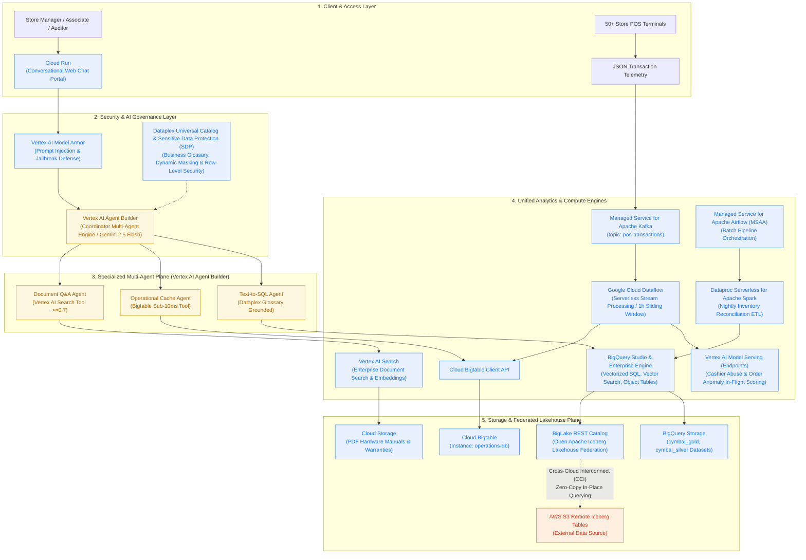
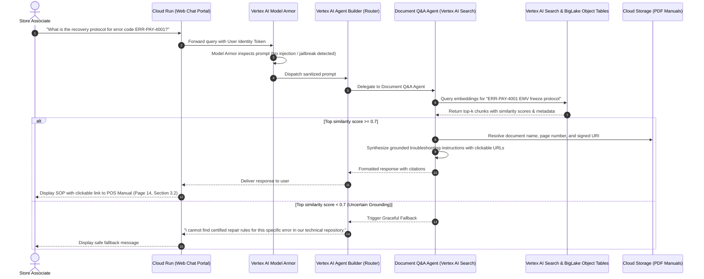
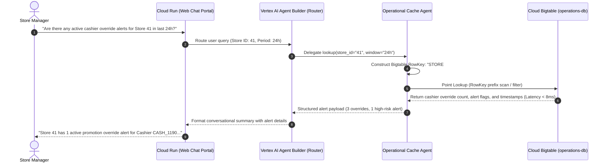
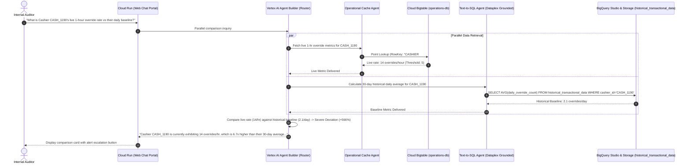
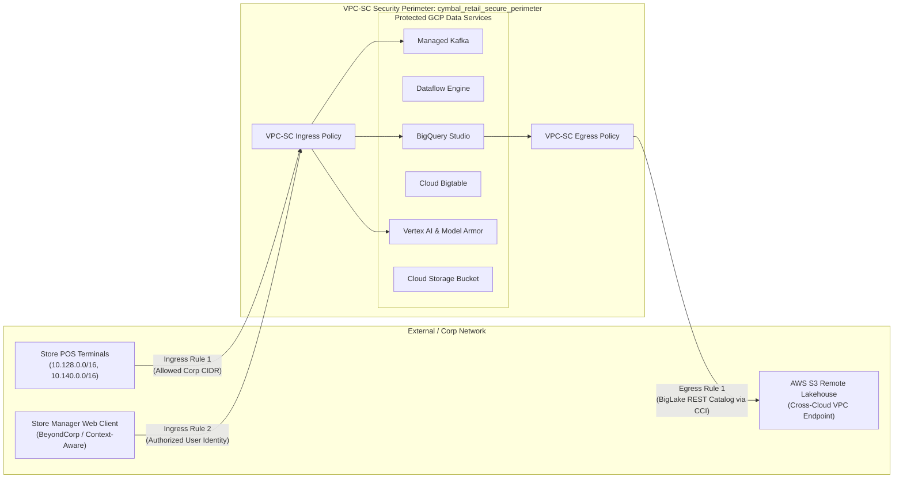
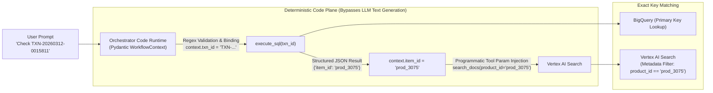

# **SOLUTION DESIGN DOCUMENT (SDD)**

# **Document Control**

## **Document Metadata**

| Field | Value |
| :---- | :---- |
| Project Name | Cymbal Retail — Agentic AI & Data Platform Modernization |
| Author(s) | Luke Lee (lukekflee@) / Google Cloud Solution Architecture Team |
| Date | 2026-09-08 |
| Status | Approved / Ready for Implementation |
| Target Audience | Evaluation Committee, Lead Architects, Technical Review Board |
| Target GCP Project | `eco-emissary-356802` |

## **Revision History**

| Version | Date | Author | Description of Change |
| :---- | :---- | :---- | :---- |
| 0.1 | 2026-09-08 | Luke Lee | Initial solution design outline & requirement decomposition |
| 1.0 | 2026-09-08 | Luke Lee | Complete end-to-end architecture, sequence diagrams, tool contracts, governance & FinOps |

---

# **1. Problem Statement & Scope Boundaries**

## **1.1. Problem Statement**

### **What problem are we solving?**
Cymbal Retail operates 500+ brick-and-mortar storefronts alongside a global e-commerce platform. Their legacy data infrastructure runs on AWS and Databricks. They face critical operational and financial bottlenecks:
1. **High Cross-Cloud Egress Costs**: Fragmented datasets across AWS S3 and GCP lead to recurring, unpredictable data transfer egress charges when piping data between analytical tools.
2. **Spark Infrastructure Overhead**: Fixed, persistent Databricks Spark clusters incur significant idle compute costs during non-peak hours ($0-cluster tax non-existent).
3. **24-Hour Batch Reporting Latency**: Nightly batch runs create 24-hour operational blind spots, preventing timely detection of POS cashier promotion override abuse and order anomalies.
4. **Dark Unstructured Data**: Crucial POS hardware troubleshooting guides and warranty documents exist as stranded PDFs in object storage, forcing manual, error-prone store-floor support.
5. **Lack of Multimodal Agentic Capabilities**: No unified conversational interface exists to allow store managers and planners to query structured metrics, real-time alerts, and technical documents in natural language.

### **Who is affected?**
* **Store Managers & Cashier Supervisors**: Require instant visibility into intraday revenue, stock cover hours, and real-time cashier promotion override flags.
* **Shop-Floor Associates**: Require rapid, citation-grounded troubleshooting steps for frozen or malfunctioning POS terminals.
* **Supply Chain & Inventory Planners**: Need real-time inventory reconciliation and supply chain defect traceability.
* **Enterprise Security & Compliance Officers**: Must ensure customer payment card numbers (PCI-DSS) are never leaked in LLM prompts or chat logs.

### **What is the impact?**
* Financial loss due to undetected checkout promotion fraud and cashier shrink.
* Increased customer checkout wait times when POS terminals freeze or fail.
* Inflated cloud infrastructure TCO caused by redundant cross-cloud data copies and idle compute.
* Potential regulatory penalties if unmasked PII/PCI data appears in conversational audit trails.

### **Why now?**
With Google Cloud’s **Agentic Data Cloud**, open Apache Iceberg federation, Serverless Spark, and Gemini-native AI agent platforms, Cymbal Retail can leapfrog traditional brittle ETL pipelines. They can establish an AI-native system of action that delivers zero-copy analytics, sub-second operational lookups, and grounded conversational agents.

---

## **1.2. Scope Boundaries**

### ***In Scope for Solution***
* **Data Foundations & Lakehouse**: Cross-cloud zero-copy federation to AWS S3 Iceberg tables via BigLake REST Catalog (`cymbal-lakehouse`), Dataproc Serverless Spark batch ETL, GCS unstructured document repository, and central metadata governance via Dataplex.
* **Real-Time Operations & Streaming**: High-throughput POS transaction ingestion via Google Managed Kafka (`kafka-cluster`), stream processing with sliding-window cashier aggregations, low-latency operational caching via Cloud Bigtable (`operations-db`), and Vertex AI real-time anomaly inference endpoints.
* **Agentic Operations Portal**: Web conversational assistant featuring a Coordinator Router Agent with specialized subagents (Text-to-SQL analytics, Bigtable cache lookup, RAG technical manual Q&A) communicating via standardized tool protocols.
* **Security, Governance & Privacy**: Column-level policy tags (`cymbal_pii`) for dynamic PCI-DSS credit card masking (`XXXX-XXXX-XXXX-9999`), store-manager row-level security (RLS), and strict RAG grounding guardrails (similarity threshold ≥ 0.7).

### ***Out of Scope for Solution***
* Direct write-backs to legacy AWS S3 tables or regional store relational databases (read-only federation).
* Multi-lingual conversational support (English only for pilot).
* Telephony (IVR / VoIP) audio interface integration.
* Production enterprise SSO synchronization (Okta / Active Directory); mocked via validated JWT headers and functional GCP service accounts.
* Multi-tenant logical isolation beyond single-tenant project sandboxing.

---

## **1.3. Target Architecture Overview**

The solution architecture integrates three primary planes:
1. **Data Ingestion & Lakehouse Federation Plane**: Ingests real-time events via Managed Kafka and federates external AWS S3 Iceberg datasets without physical data replication.
2. **Analytical & Operational Storage Plane**: Combines BigQuery (vectorized analytics & object tables), Cloud Bigtable (sub-10ms operational cache), and GCS (unstructured documents).
3. **Agentic Orchestration & AI Inference Plane**: A multi-agent framework powered by Gemini, coordinated via an Agent Gateway with strict policy guardrails and tool contracts.



### **Component Descriptions (Google Cloud Native Architecture)**

| Component Category | Modern Google Cloud Service | Role & Responsibility | Key Interface / Protocol |
| :--- | :--- | :--- | :--- |
| **Front-End & Runtime** | **Cloud Run** | Serverless hosting for the multi-turn conversational web chat portal (React / Streamlit). | HTTPS / WebSockets, OIDC / JWT |
| **AI Security Gateway** | **Vertex AI Model Armor** | Inspects user prompts & model responses for prompt injection, jailbreaking, toxicity, and sensitive data leakage. | Vertex AI Model Armor API |
| **Agent Orchestrator** | **Vertex AI Agent Builder** | Coordinates multi-agent reasoning, intent routing, and tool invocation using **Gemini 2.5 Flash**. | Vertex AI Reasoning Engine / Extensions API |
| **Document Search (RAG)** | **Vertex AI Search** | Managed document chunking, vector indexing, and grounded retrieval over GCS technical manuals (Threshold ≥ 0.7). | Vertex AI Search API / Discovery Engine |
| **Data Governance & Catalog** | **Dataplex Universal Catalog** | Centralized metadata management, business glossaries (`certified=true`), schema lineage, and policy tags. | Dataplex API, GoogleSQL Policy Tags |
| **Data Privacy & Redaction** | **Sensitive Data Protection (SDP)** | Dynamic masking of customer credit card PII (`XXXX-XXXX-XXXX-9999`) and sensitive tokens across all logs and chat turns. | BigQuery Data Policy (`mask_card_number`) |
| **Lakehouse Federation** | **BigLake REST Catalog** | Open Apache Iceberg REST Catalog enabling zero-copy, in-place analytics on remote AWS S3 Iceberg tables over CCI. | Apache Iceberg REST Catalog API, AWS STS AssumeRole |
| **Analytical Query Engine** | **BigQuery Studio & Enterprise Edition** | Vectorized query processing, GoogleSQL analytics, vector indexing, and BigLake Object Tables. | BigQuery Storage Read/Write API, GoogleSQL |
| **Real-Time Event Broker** | **Managed Service for Apache Kafka** | First-party managed event streaming cluster (`kafka-cluster`) ingesting POS telemetry from 50+ stores. | Kafka Protocol (Port 9092, mTLS/VPC) |
| **Stream Processing** | **Google Cloud Dataflow** | Serverless stream processing executing 1-hour sliding-window aggregations on cashier promotion overrides. | Apache Beam Pipeline Engine, Streaming Runner |
| **Operational Cache** | **Cloud Bigtable** | Wide-column NoSQL database (`operations-db`) providing sub-10ms latency point lookups for live cashier risk states. | Bigtable gRPC API, BigQuery Bigtable Federation |
| **Real-Time ML Scoring** | **Vertex AI Model Serving (Endpoints)** | Sub-50ms in-flight scoring for POS transaction order anomalies and cashier promotion abuse behavior. | Vertex AI Online Prediction REST / gRPC API |
| **Batch Orchestration** | **Managed Service for Apache Airflow (MSAA)** | Managed Airflow environment (`cymbal-airflow-env`) orchestrating nightly synchronization and batch pipelines. | Airflow DAGs, Celery / Kubernetes Executor |
| **Batch Compute Engine** | **Dataproc Serverless for Apache Spark** | Containerized, serverless Spark ETL for nightly inventory reconciliation and sales deduplication (scales to $0). | Dataproc Batches API, PySpark / Spark SQL |
| **Unstructured Document Store**| **Cloud Storage (GCS)** | Object repository (`eco-emissary-356802-module1-bucket`) storing raw PDF repair manuals and warranty policies. | Cloud Storage JSON API, BigLake Object Tables |

---

## **1.4. Alternatives Considered**

| Architecture Decision / Area | Alternative Evaluated | Chosen Approach | Rationale & Trade-offs |
| :--- | :--- | :--- | :--- |
| **Multi-Cloud Data Access** | **BigQuery Omni**: Bring compute to AWS by hosting BigQuery compute clusters in AWS. | **Cross-Cloud Lakehouse Federation**: Centralized GCP compute querying remote AWS S3 Iceberg tables over CCI. | **Why Chosen**: BigQuery Omni cannot natively leverage Google’s cutting-edge AI features (Gemini, vector indexing, geospatial, BQML). Lakehouse Federation centralizes compute in GCP, enabling 100% feature parity while slashing egress costs by up to 80% using private Cross-Cloud Interconnect and intelligent caching. |
| **Batch Normalization Compute** | **Persistent Databricks/Spark Clusters**: Keeping provisioned clusters running 24/7. | **Dataproc Serverless for Apache Spark**: Event-triggered, containerized batch execution. | **Why Chosen**: Eliminates the "idle cluster tax" by scaling compute down to $0 when no batch jobs are running; auto-terminates within 60 seconds of job completion. |
| **Operational Cache Storage** | **Relational PostgreSQL (Cloud SQL)**: Storing streaming sliding-window aggregations in relational tables. | **Cloud Bigtable (`operations-db`)**: Wide-column NoSQL database with custom row-key indexing. | **Why Chosen**: Bigtable provides guaranteed single-digit millisecond latency (P95 < 10ms) for high-throughput point lookups (e.g., `CASHIER#<id>#<date>`), handling massive scale without connection pooling limits. |
| **Document Search Engine** | **External ElasticSearch Cluster**: Managing a self-hosted vector database cluster. | **BigQuery Object Tables + Vertex AI Search**: Managed vector embeddings directly over GCS PDF files. | **Why Chosen**: Eliminates operational overhead of running search clusters; enables unified SQL joins between structured transaction tables and unstructured document chunks. |

---

# **2. Production-Ready Future State Design**

As Cymbal Retail scales from the 50-store pilot to all 500+ physical stores and the global e-commerce platform:
1. **Multi-Region High Availability**:
   * BigQuery Cross-Region Replication guarantees active-passive disaster recovery across `us-central1` and `us-east4`.
   * Cloud Bigtable configured with multi-cluster replication across two availability zones for 99.999% SLA.
2. **Horizontal Elasticity**:
   * Managed Kafka partitions scale dynamically from 5 to 50 partitions to ingest up to 25,000 transactions/sec during Black Friday peaks.
   * BigQuery Enterprise Reservations utilize dynamic Autoscaling Slots, scaling from 0 to 2,000 slots without human intervention.
3. **Observability & Health Telemetry**:
   * All agent turns, SQL translation traces, and vector similarity scores export directly to Cloud Logging and Cloud Trace.
   * Alerts configure in Cloud Monitoring for any P95 conversational latency exceeding 6 seconds or ML inference error rates exceeding 0.1%.

---

# **3. System Flows, Sequence Diagrams & Agent Design**

## **3.1. Sequence Diagram 1: Single-Domain RAG POS Troubleshooting (UC-1.1)**
Demonstrates prompt grounding, vector search, similarity threshold guardrails, and clickable citation generation.



---

## **3.2. Sequence Diagram 2: Single-Domain Real-Time Cache Lookup (UC-1.3)**
Demonstrates single-digit millisecond point lookups against Cloud Bigtable.



---

## **3.3. Sequence Diagram 3: Multi-Domain Warranty Triage (UC-2.1)**
Demonstrates multi-system orchestration across historical relational tables (BigQuery) and unstructured warranty documentation (RAG).

```mermaid
sequenceDiagram
    autonumber
    actor Associate as Customer Service Associate
    participant UI as Cloud Run (Web Chat Portal)
    participant Router as Vertex AI Agent Builder (Router)
    participant SQLAgent as Text-to-SQL Agent (Dataplex Grounded)
    participant BQ as BigQuery Studio & Storage (cymbal_gold)
    participant RAGAgent as Document Q&A Agent (Vertex AI Search)
    participant VectorDB as Vertex AI Search & BigLake Object Tables

    Associate->>UI: "Customer CUST_02598 bought an item with Gift Card. Is it covered under warranty?"
    UI->>Router: Multi-domain warranty triage request
    
    rect rgb(235, 245, 255)
        note over Router,BQ: Step 1: Historical Sales Resolution
        Router->>SQLAgent: Find purchase details for CUST_02598
        SQLAgent->>BQ: SELECT item_id, purchase_date, payment_type FROM historical_transactional_data WHERE customer_id='CUST_02598'
        BQ-->>SQLAgent: Return Item: prod_3075 (Headphones), Date: 2026-02-10, Payment: GIFT_CARD
        SQLAgent-->>Router: Purchase Context Resolved
    end

    rect rgb(255, 248, 230)
        note over Router,VectorDB: Step 2: Unstructured Warranty Coverage Lookup
        Router->>RAGAgent: Query warranty rules for prod_3075 with Gift Card purchase
        RAGAgent->>VectorDB: Search warranty chunks for "Headphones warranty gift card coverage policy"
        VectorDB-->>RAGAgent: Return Warranty Policy Chunk (Score 0.88, 1-year coverage valid for all payment methods)
        RAGAgent-->>Router: Warranty Clause Resolved
    end

    Router->>Router: Synthesize multi-domain verdict (Purchase is within 1 year; Gift Card is fully covered)
    Router-->>UI: "Yes, the product (prod_3075) purchased on Feb 10, 2026 is fully covered under the 1-year warranty..."
    UI-->>Associate: Display synthesis with warranty document link
```

---

## **3.4. Sequence Diagram 4: Multi-Domain Cashier Risk vs. Nightly Audit (UC-2.2)**
Demonstrates parallel execution across real-time Bigtable cache and BigQuery historical baselines.



---

# **4. Data Platform Architecture, Security & Governance**

## **4.1. Entity Definitions, Storage Schema & Data Lifecycle Management**

### **4.1.1. BigQuery Datasets & Explicit Lifecycle Policies**

To strictly manage long-term storage costs and prevent unbounded data accumulation across retail operations, Cymbal Retail enforces dataset-level default expirations, table-level partition expirations, and automatic long-term pricing transitions:

| Dataset / Table | Medallion Layer | Partitioning & Clustering Strategy | Explicit Partition Expiration Policy | Storage Pricing Tier & Retention Lifecycle | Cost Optimization Rationale |
| :--- | :--- | :--- | :--- | :--- | :--- |
| **`cymbal_bronze.*`** | Bronze (Raw Landing) | Partitioned by `DAY(_PARTITIONDATE)` | **30 Days** (`default_partition_expiration_ms = 2,592,000,000`) | Dropped automatically after 30 days. No long-term storage. | Prevents high-throughput streaming Kafka telemetry dumps from accumulating unmanaged storage debt. |
| **`cymbal_silver.*`** | Silver (Conformed Facts & Dims) | Partitioned by `DAY(order_date)`, clustered by `store_id`, `customer_id` | **90 Days Active** (`default_partition_expiration_ms = 7,776,000,000`) | Partitions unedited for > 90 days automatically drop to **BigQuery Long-Term Storage Pricing** ($0.01/GB/mo, 50% discount). | Maximizes vectorized scan performance for current quarter analytics while cutting dormant data storage costs in half. |
| **`historical_transactional_data`** (`cymbal_gold`) | Gold (Curated Fact) | Partitioned by `DAY(business_date)`, clustered by `transaction_id`, `store_id`, `cashier_id` | **730 Days (2 Years)** (`partition_expiration_days = 730`) | Active rate for 90 days ($0.02/GB); remaining 640 days billed at Long-Term Storage ($0.01/GB). Dropped after 24 months. | Retains conformed transactions for tax auditing, multi-year fraud models, and warranty triage while bounding max footprint. |
| **`gold_inventory_reconciliation_ledger`** (`cymbal_gold`) | Gold (Audit Ledger) | BigLake Iceberg Managed Table on GCS, partitioned by `DAY(reconciliation_date)` | **365 Days (1 Year)** | Parquet format; GCS Object Lifecycle rules manage cold tiering automatically. | Preserves daily opening/closing inventory balances for fiscal year reporting with zero compute tax. |
| **`cymbal_governance`** (Audit Logs & Agent Traces) | Governance & Audit | Partitioned by `DAY(timestamp)` | **180 Days (6 Months)** (`partition_expiration_days = 180`) | 90 days active, 90 days long-term. Hard purge at 180 days. | Fully complies with enterprise security audit standards while preventing LLM prompt/completion trace bloat. |

### **4.1.2. Cloud Bigtable Operational Cache Schema & GC Policy**
* **Instance**: `operations-db`, Table: `pos_operational_cache`
* **Column Family**: `cf_metrics`
* **Garbage Collection (GC) Policy**: `gc_rule = "max_age = '7d'"` (Strict 7-day TTL automatically evicts obsolete sliding-window cashier metrics and alert statuses, maintaining a flat storage footprint < 50 GB).
* **Row Key Design**:
  * Store Rollup: `STORE#<store_id>#<YYYYMMDD>`
  * Cashier Rollup: `CASHIER#<cashier_id>#<YYYYMMDDHH>`
* **Column Qualifiers**: `override_count_1h`, `anomaly_score`, `last_transaction_ts`, `alert_status`.

### **4.1.3. Cloud Storage (GCS) Unstructured Data Lifecycle Rules**
For bucket `eco-emissary-356802-module1-bucket` (storing POS hardware manuals and warranty PDFs):
* **Age > 30 Days**: Automatically transitions objects to **Nearline Storage** ($0.010/GB/month).
* **Age > 90 Days**: Automatically transitions objects to **Coldline Storage** ($0.004/GB/month).
* **Age > 365 Days**: Transitions archival copies to **Archive Storage** ($0.0012/GB/month).
* **Noncurrent Object Versions**: Permanently deleted after 14 days to prevent stale document accumulation.

### **4.1.4. Real-Time POS Transaction Telemetry JSON Schema Contract (`pos-transactions`)**

To prevent downstream data engineering ambiguity, Dataflow pipeline deserialization errors, and schema inference drift, all POS terminals across the 50 storefronts must emit strictly validated JSON payloads adhering to the following **JSON Schema (Draft-07)** specification:

```json
{
  "$schema": "http://json-schema.org/draft-07/schema#",
  "title": "POSTransactionTelemetryEvent",
  "description": "Real-time checkout event emitted from in-store POS terminals to Managed Service for Apache Kafka (topic: pos-transactions)",
  "type": "object",
  "required": [
    "transaction_id",
    "timestamp",
    "store_id",
    "pos_terminal_id",
    "cashier_id",
    "customer_id",
    "basket",
    "total_amount",
    "payment_details",
    "override_details"
  ],
  "properties": {
    "transaction_id": {
      "type": "string",
      "pattern": "^TXN-[0-9]{8}-[0-9]{7}$",
      "description": "Unique transaction identifier with date and sequence (e.g., TXN-20260312-0015811)"
    },
    "timestamp": {
      "type": "string",
      "format": "date-time",
      "description": "ISO-8601 UTC timestamp of checkout completion (e.g., 2026-03-12T14:22:18.124Z)"
    },
    "store_id": {
      "type": "string",
      "pattern": "^STORE_[0-9]{3}$",
      "description": "Store location identifier (e.g., STORE_041)"
    },
    "pos_terminal_id": {
      "type": "string",
      "pattern": "^TERM_[0-9]{2}$",
      "description": "Physical POS checkout lane terminal ID (e.g., TERM_04)"
    },
    "cashier_id": {
      "type": "string",
      "pattern": "^CASH_[0-9]{4}$",
      "description": "Operating cashier employee identifier (e.g., CASH_1190)"
    },
    "customer_id": {
      "type": "string",
      "pattern": "^CUST_[0-9]{5}$",
      "description": "Loyalty customer account identifier (e.g., CUST_02598)"
    },
    "basket": {
      "type": "array",
      "minItems": 1,
      "description": "Collection of line items purchased in this transaction",
      "items": {
        "type": "object",
        "required": [
          "item_id",
          "item_name",
          "product_category",
          "quantity",
          "unit_price",
          "discount_applied_pct",
          "subtotal"
        ],
        "properties": {
          "item_id": {
            "type": "string",
            "pattern": "^prod_[0-9]{4}$",
            "description": "SKU catalog identifier (e.g., prod_3075)"
          },
          "item_name": {
            "type": "string",
            "description": "Human-readable item title"
          },
          "product_category": {
            "type": "string",
            "enum": ["AUDIO", "COMPUTING", "MOBILE", "ACCESSORIES", "HOME_APPLIANCES"]
          },
          "quantity": {
            "type": "integer",
            "minimum": 1
          },
          "unit_price": {
            "type": "number",
            "minimum": 0.0
          },
          "discount_applied_pct": {
            "type": "number",
            "minimum": 0.0,
            "maximum": 100.0
          },
          "subtotal": {
            "type": "number",
            "minimum": 0.0
          }
        }
      }
    },
    "total_amount": {
      "type": "number",
      "minimum": 0.0,
      "description": "Net transaction value including applicable sales taxes"
    },
    "payment_details": {
      "type": "object",
      "required": ["payment_type", "masked_card_number", "auth_approval_code"],
      "properties": {
        "payment_type": {
          "type": "string",
          "enum": ["CREDIT_CARD", "DEBIT_CARD", "GIFT_CARD", "CASH", "MOBILE_WALLET"]
        },
        "masked_card_number": {
          "type": "string",
          "pattern": "^(XXXX-XXXX-XXXX-[0-9]{4}|N/A)$",
          "description": "Pre-masked PCI-DSS compliant credit card representation"
        },
        "auth_approval_code": {
          "type": "string",
          "description": "Bank authorization code (e.g., AUTH_884920)"
        }
      }
    },
    "override_details": {
      "type": "object",
      "required": ["override_flag", "supervisor_id", "override_reason", "override_discount_amount"],
      "properties": {
        "override_flag": {
          "type": "boolean",
          "description": "True if cashier manually applied a discount override outside approved catalog promotions"
        },
        "supervisor_id": {
          "type": ["string", "null"],
          "pattern": "^SUPV_[0-9]{4}$",
          "description": "Approving supervisor ID if override exceeded cashier limit"
        },
        "override_reason": {
          "type": ["string", "null"],
          "enum": [null, "DAMAGED_PACKAGING", "PRICE_MATCH", "CUSTOMER_SATISFACTION", "SYSTEM_GLITCH"]
        },
        "override_discount_amount": {
          "type": "number",
          "minimum": 0.0,
          "description": "Monetary value of the manual discount applied"
        }
      }
    }
  }
}
```

#### **Production Payload Example**
```json
{
  "transaction_id": "TXN-20260312-0015811",
  "timestamp": "2026-03-12T14:22:18.124Z",
  "store_id": "STORE_041",
  "pos_terminal_id": "TERM_04",
  "cashier_id": "CASH_1190",
  "customer_id": "CUST_02598",
  "basket": [
    {
      "item_id": "prod_3075",
      "item_name": "Pro Wireless Noise-Canceling Headphones",
      "product_category": "AUDIO",
      "quantity": 1,
      "unit_price": 249.99,
      "discount_applied_pct": 20.0,
      "subtotal": 199.99
    }
  ],
  "total_amount": 215.99,
  "payment_details": {
    "payment_type": "GIFT_CARD",
    "masked_card_number": "N/A",
    "auth_approval_code": "AUTH_773192"
  },
  "override_details": {
    "override_flag": true,
    "supervisor_id": "SUPV_0042",
    "override_reason": "CUSTOMER_SATISFACTION",
    "override_discount_amount": 50.00
  }
}
```

---

## **4.2. Security, Privacy & Data Governance**

### **4.2.1. Role-Based & Row-Level Access Control (RLS)**
* Delegated User Identity Tokens pass via gRPC / HTTP headers (`X-Goog-Authenticated-User-Email`).
* Row-level security filters applied automatically: Store Managers can only query records where `store_id = SESSION_USER_STORE_ID()`.

### **4.2.2. PCI-DSS Dynamic Data Masking**
* Column-level policy tag `projects/eco-emissary-356802/locations/us-central1/taxonomies/.../categories/cymbal_pii` attached to `card_number`.
* Unauthorized personas (Store Managers, Sales Associates, LLM Tool Prompts) execute via custom routine `mask_card_number`, receiving only masked values: `XXXX-XXXX-XXXX-9999`.
* Only credentialed Security Auditors with `roles/bigquerydatapolicy.maskedReader` access raw credit card numbers.

### **4.2.3. AI Guardrails & Grounding Validation**
* Incoming user prompts pass through Vertex AI Model Armor to intercept jailbreak attempts and prompt injection attacks.
* RAG outputs must adhere to a strict minimum vector similarity score of 0.7; any chunk below this threshold triggers an immediate refusal to prevent hallucinated advice.

### **4.2.4. VPC Service Controls (VPC-SC) Perimeter & Detailed Ingress/Egress Policies**

To protect sensitive retail transaction data, PII, and proprietary ML endpoints from data exfiltration, unauthorized network access, and lateral movement, project `eco-emissary-356802` is enclosed in a fully managed **VPC Service Controls (VPC-SC)** security perimeter:

* **Perimeter Name**: `accessPolicies/108492019/servicePerimeters/cymbal_retail_secure_perimeter`
* **Enforced Project**: `projects/89512879998` (`eco-emissary-356802`)
* **Restricted Services List**:
  * `bigquery.googleapis.com` (Analytics, Vector Search & Lakehouse)
  * `storage.googleapis.com` (Unstructured PDF manuals & BigLake Parquet tables)
  * `bigtable.googleapis.com` (Low-latency operational cache)
  * `managedkafka.googleapis.com` (POS event broker)
  * `aiplatform.googleapis.com` (Vertex AI Agent Builder, Model Serving, Model Armor)
  * `dataplex.googleapis.com` (Universal Catalog & Governance)
  * `composer.googleapis.com` (Managed Service for Apache Airflow)
  * `dataproc.googleapis.com` (Dataproc Serverless Spark)



#### **Detailed Ingress Policies**
1. **Ingress Rule 1: Store POS Telemetry Ingestion to Managed Kafka**:
   * **From**: Sources = Network CIDR ranges `10.128.0.0/16` and `10.140.0.0/16` (Private Interconnect/Cloud VPN from 50 store locations) or Access Level `al_pos_terminal_network`.
   * **To**: Target Project = `projects/89512879998`, Target Service = `managedkafka.googleapis.com`, Methods = `["*"]` (Produces on Port 9092 via PSC endpoints).
2. **Ingress Rule 2: Store Manager Conversational Chat Portal**:
   * **From**: Identity = Service Account `cymbal-sa-data@eco-emissary-356802.iam.gserviceaccount.com` (Cloud Run runtime identity) and Users satisfying Access Level `al_corp_beyondcorp_device`.
   * **To**: Target Project = `projects/89512879998`, Target Service = `aiplatform.googleapis.com`, Methods = `["google.cloud.aiplatform.v1.PredictionService.*", "google.cloud.discoveryengine.v1.*"]`.
3. **Ingress Rule 3: Data Lead & SecOps Administration**:
   * **From**: Identities = `sa-data-lead@eco-emissary-356802.iam.gserviceaccount.com`, `admin@lukekflee.altostrat.com`.
   * **To**: Target Project = `projects/89512879998`, Target Services = `bigquery.googleapis.com`, `dataplex.googleapis.com`, `composer.googleapis.com`.

#### **Detailed Egress Policies**
1. **Egress Rule 1: Cross-Cloud Lakehouse Federation to AWS S3 & Glue**:
   * **From**: Identity = `blirc-89512879998-m26clzth@gcp-sa-biglakerestcatalog.iam.gserviceaccount.com` (BigLake Service Account, Subject ID: `107843576032310825663`).
   * **To**: External Entity / Network = Private Cross-Cloud Interconnect (CCI) routing to AWS PrivateLink endpoints:
     * AWS S3: `s3.us-east-1.amazonaws.com` (Bucket: `arn:aws:s3:::cymbal-retail-lakehouse-bucket`)
     * AWS Glue: `glue.us-east-1.amazonaws.com` (Catalog: `123456789012`)
2. **Egress Rule 2: Vertex AI Search GCS Object Table Ingestion**:
   * **From**: Identity = `service-89512879998@gcp-sa-discoveryengine.iam.gserviceaccount.com`.
   * **To**: Target Service = `storage.googleapis.com`, Scoped Project = `projects/89512879998` (Resource: `projects/_/buckets/eco-emissary-356802-module1-bucket`).

---

## **4.3. Cross-Account Handshake & AWS IAM Trust Policy for S3 Federation**

To establish zero-copy federated analytics over AWS S3 Apache Iceberg tables without permanent access keys, Cymbal Retail implements an **OpenID Connect (OIDC) Web Identity Federation** handshake between Google Cloud BigLake and AWS IAM:

* **Google Cloud BigLake REST Catalog Service Account**:
  * Email: `blirc-89512879998-m26clzth@gcp-sa-biglakerestcatalog.iam.gserviceaccount.com`
  * Unique Service Account ID (`sub`): `107843576032310825663` (Registered via `go/da-advanced-sa-id`)
  * OIDC Identity Provider (Issuer): `accounts.google.com`
* **Target AWS IAM Role**:
  * Role ARN: `arn:aws:iam::123456789012:role/CymbalBigLakeIcebergRole`

### **4.3.1. Exact AWS IAM Trust Policy (`TrustRelationship.json`)**
Attached to `arn:aws:iam::123456789012:role/CymbalBigLakeIcebergRole`. Enforces cryptographic token validation verifying that only BigLake requests originating from Cymbal's specific Google Cloud service account are permitted to assume the role:

```json
{
  "Version": "2012-10-17",
  "Statement": [
    {
      "Sid": "BigLakeOIDCAssumeRoleWithWebIdentity",
      "Effect": "Allow",
      "Principal": {
        "Federated": "accounts.google.com"
      },
      "Action": "sts:AssumeRoleWithWebIdentity",
      "Condition": {
        "StringEquals": {
          "accounts.google.com:sub": "107843576032310825663",
          "accounts.google.com:aud": "https://biglake.googleapis.com"
        }
      }
    }
  ]
}
```

### **4.3.2. Exact AWS IAM Permissions Policy (`BigLakeS3GluePermissions.json`)**
Grants the assumed role least-privilege read-only permissions across the remote AWS S3 Iceberg data files and AWS Glue metadata catalog:

```json
{
  "Version": "2012-10-17",
  "Statement": [
    {
      "Sid": "AllowS3IcebergBucketList",
      "Effect": "Allow",
      "Action": [
        "s3:GetBucketLocation",
        "s3:ListBucket"
      ],
      "Resource": [
        "arn:aws:s3:::cymbal-retail-lakehouse-bucket"
      ]
    },
    {
      "Sid": "AllowS3IcebergObjectRead",
      "Effect": "Allow",
      "Action": [
        "s3:GetObject",
        "s3:GetObjectVersion"
      ],
      "Resource": [
        "arn:aws:s3:::cymbal-retail-lakehouse-bucket/silver/*",
        "arn:aws:s3:::cymbal-retail-lakehouse-bucket/metadata/*"
      ]
    },
    {
      "Sid": "AllowGlueCatalogMetadataRead",
      "Effect": "Allow",
      "Action": [
        "glue:GetDatabase",
        "glue:GetDatabases",
        "glue:GetTable",
        "glue:GetTables",
        "glue:GetPartitions"
      ],
      "Resource": [
        "arn:aws:glue:us-east-1:123456789012:catalog",
        "arn:aws:glue:us-east-1:123456789012:database/cymbal_lakehouse",
        "arn:aws:glue:us-east-1:123456789012:table/cymbal_lakehouse/*"
      ]
    }
  ]
}
```

### **4.3.3. BigLake External Schema Registration (GoogleSQL DDL)**
Once the AWS trust handshake is active, BigQuery registers the remote Iceberg dataset seamlessly:

```sql
-- Register remote AWS S3 Iceberg Catalog into Google Cloud BigQuery
CREATE OR REPLACE EXTERNAL SCHEMA `eco-emissary-356802.cymbal_lakehouse_aws`
WITH CONNECTION `us-central1.cymbal-lakehouse`
OPTIONS (
  format = 'ICEBERG',
  catalog_type = 'AWS_GLUE',
  catalog_id = '123456789012',
  role_arn = 'arn:aws:iam::123456789012:role/CymbalBigLakeIcebergRole',
  location = 's3://cymbal-retail-lakehouse-bucket/silver/'
);
```

---

# **5. Integration Details, Tool Contracts & Error Handling**

## **5.1. Agent Tool & API Contracts**

| Tool / Interface Name | Calling Agent | Target System | Input Parameters | Expected Output / SLA | Error / Fallback Behavior |
| :--- | :--- | :--- | :--- | :--- | :--- |
| **`query_sales_metrics`** | Coordinator / SQL Subagent | BigQuery (`cymbal_gold`) | `{"store_id": STRING, "start_date": DATE, "end_date": DATE, "metrics": LIST}` | Aggregated metrics JSON (SLA: < 2.5s) | If table unreachable or syntax error, return clean warning: *"Sales analytics service unavailable"*. Retry up to 2 times. |
| **`lookup_operational_cache`** | Coordinator / Cache Subagent | Cloud Bigtable (`operations-db`) | `{"entity_type": "STORE"\|"CASHIER", "entity_id": STRING, "window": STRING}` | Override count, anomaly flags (SLA: < 50ms) | If row key missing, return: `{"status": "NO_ACTIVE_ALERTS", "overrides": 0}`. |
| **`search_technical_manuals`** | Coordinator / RAG Subagent | BigQuery Vector Search / GCS | `{"query": STRING, "top_k": INT, "doc_type": "POS_MANUAL"\|"WARRANTY"}` | Top text chunks with document URL, page number, and similarity score (SLA: < 1.8s) | If max similarity < 0.7, trigger fallback: *"I cannot find certified repair rules in our repository."* |
| **`score_transaction_realtime`** | Streaming Worker | Vertex AI Endpoints | `{"cashier_id": STRING, "discount_pct": FLOAT, "item_count": INT, "amount": FLOAT}` | `{"anomaly_score": FLOAT, "fraud_risk": "LOW"\|"HIGH"}` (SLA: < 40ms) | If endpoint fails, log incident and push transaction to dead-letter topic without blocking stream. |

## **5.2. Failure Modes & Comprehensive Error-Handling Matrix**

To ensure high availability, enterprise resilience, and predictable degradation across multi-system operations, Cymbal Retail maps every component failure mode to automated detection, retry/circuit breaker policies, and graceful fallback actions:

| Subsystem / Layer | Component | Failure Mode / Scenario | Detection Mechanism & Error Code | Circuit Breaker & Retry Policy | Fallback Action / Degradation Strategy | Automated Recovery / Self-Healing |
| :--- | :--- | :--- | :--- | :--- | :--- | :--- |
| **Client & Gateway** | **Cloud Run (Chat Portal)** | Client connection drop or WebSocket timeout during turn (> 6.0s). | `HTTP 504 Gateway Timeout` / Client disconnect event | Reconnect with exponential backoff (1s, 2s, 4s; max 3 retries). | Render partial streamed response with notification: *"Response streaming timed out; last known status preserved."* | Container auto-scales and routes subsequent turns to healthy instances. |
| **AI Security** | **Vertex AI Model Armor** | Prompt injection attack or malicious jailbreak attempt detected. | `MODEL_ARMOR_INJECTION_DETECTED` / `HTTP 400 Bad Request` | **Zero Retry** (Immediate request drop). | Deliver standardized refusal: *"Your prompt contains patterns violating enterprise security policies."* | Logs attacker token and prompt hash to Cloud Logging; triggers security telemetry alert. |
| **Agent Orchestration** | **Vertex AI Agent Builder** | Intent classification ambiguity or unmapped retail domain (Confidence < 0.65). | Intent classifier confidence score < 0.65 | **Zero Retry** (Prevents hallucinated routing). | Present interactive disambiguation buttons: *"Did you mean: (1) Check Store Inventory, (2) POS Repair Manual, or (3) Cashier Risk?"* | Unmapped queries export to Dataplex audit logs for continuous glossary fine-tuning. |
| **Lakehouse Federation** | **BigLake REST Catalog / AWS S3** | Cross-Cloud link down, AWS STS AssumeRole token expiry, or S3 unreachable. | `UNAVAILABLE` / `401 Unauthorized` / `ERR-CCI-TIMEOUT` | Circuit breaker trips after 3 consecutive failures (60s open-window cooldown). | Deliver degraded response: *"Historical AWS data is temporarily unreachable. Live store alerts and local inventory remain available."* | Workload Identity Federation auto-refreshes AWS STS tokens; CCI auto-re-establishes BGP routes. |
| **Analytical Query** | **BigQuery Studio & Engine** | Slot reservation saturation or concurrent query quota exhaustion. | `RESOURCE_EXHAUSTED` / `429 Quota Exceeded` | Exponential backoff with jitter (initial: 500ms, max 3 retries); Autoscaling Slots burst. | Query automatically redirects to cached summary rollups in `cymbal_gold` dataset. | BigQuery Enterprise Autoscaling Slots expand from baseline up to max burst reservation. |
| **Data Privacy & Governance** | **Sensitive Data Protection (SDP)** | Policy tag evaluation failure or unauthorized reader persona attempting PII query. | `PERMISSION_DENIED` / `403 DataPolicyEvaluationError` | Zero Retry for access denial; 1 retry if transient auth sync delay. | Dynamic column masking routine automatically replaces card digits with `XXXX-XXXX-XXXX-9999`. | Audit event logged to Dataplex & Cloud Audit Logs; user notified of masked view. |
| **Operational Cache** | **Cloud Bigtable (`operations-db`)** | Node hotspotting or gRPC timeout during point lookup (> 50ms SLA). | `DEADLINE_EXCEEDED` / `14 UNAVAILABLE` (> 80ms) | Retry 2 times with 50ms backoff; circuit breaker trips if P99 > 200ms. | Fall back to direct indexed point lookup on BigQuery `historical_transactional_data`. | Bigtable Autoscaler automatically provisions additional nodes if CPU > 70%. |
| **Event Broker** | **Managed Service for Apache Kafka** | Broker partition rebalance or temporary leader failover. | `LEADER_NOT_AVAILABLE` / `NOT_ENOUGH_REPLICAS` | Producer retries up to 5 times (`retry.backoff.ms = 200`) using local producer in-memory buffer. | If buffer exceeds 80% capacity, spillover events route to secondary Cloud Pub/Sub dead-letter topic. | Managed Kafka cluster initiates automated partition leader election (< 3s recovery). |
| **Stream Analytics** | **Google Cloud Dataflow** | Poison-pill message (malformed JSON telemetry violating schema). | `JSON_PARSE_EXCEPTION` / `SCHEMA_VALIDATION_FAILED` | **Zero Retry** (Prevents streaming pipeline deadlock / infinite loops). | Route corrupted payload to Dead-Letter Topic (`pos-transactions-dlq`) with parse error stack trace. | Pipeline continues streaming clean events uninterrupted; alert dispatched to on-call engineer. |
| **Real-Time ML Scoring** | **Vertex AI Model Serving** | Model endpoint latency spike (> 50ms) or model container crash. | `UNAVAILABLE` / `503 Service Unavailable` (> 50ms timeout) | Timeout breaker trips at 60ms; bypasses endpoint to protect POS checkout latency. | Assign default baseline heuristic risk score (`anomaly_score = 0.0, manual_audit = true`) without blocking checkout. | Vertex AI Model Serving auto-replaces unhealthy container replicas. |
| **Document Search (RAG)** | **Vertex AI Search** | Document similarity score below grounding threshold (< 0.7) or PDF missing. | `GROUNDING_SCORE_BELOW_THRESHOLD` / `DOC_NOT_FOUND` | **Zero Retry** (Grounding guardrail enforcement). | Graceful refusal: *"I cannot find certified warranty or repair rules for this specific error in our repository."* | Unanswered query logged to GCS dark data queue for technical manual gap resolution. |
| **Batch Pipeline** | **MSAA & Dataproc Serverless** | PySpark batch reconciliation job failure / executor OOM crash. | `SPARK_JOB_FAILED` / `OOMKilled` (Exit code 137) | Managed Airflow retries DAG task up to 2 times (`retry_delay = 5m`) with +50% memory allocation. | Previous night's gold ledger snapshot remains active; morning dashboard alerts: *"Inventory baseline as of 23:59 yesterday"*. | MSAA re-launches Dataproc Serverless batch with higher executor memory overhead. |

## **5.3. Deterministic State Passing & ID Integrity Protocol (Anti-Chunking & Anti-Hallucination)**

In multi-agent architectures, passing critical entity identifiers (e.g., `transaction_id`, `product_id`, `cashier_id`, `lot_id`) via natural language prompts or free-form text chunks introduces severe vulnerabilities:
1. **BPE Tokenization Fragmentation**: Alphanumeric IDs (e.g., `TXN-20260312-0015811`, `LOT-202607-PROD2-08`) are fragmented by Byte-Pair Encoding (BPE) into arbitrary 2–3 character subword tokens. This causes leading-zero drops (`0015811` → `15811`) and delimiter corruption (`-` vs `_`).
2. **RAG / Memory Chunk Boundary Slicing**: When passing conversational transcripts or long text buffers, fixed token chunk windows can sever an ID across boundary edges, resulting in unresolvable primary keys.
3. **LLM Non-Deterministic Hallucination**: Asking an LLM to re-transcribe or re-extract IDs between conversational turns exhibits a 1%–3% non-deterministic degradation rate.

### **The Solution: Programmatic Shared Context & Hard Metadata Filtering**



To eliminate this failure mode, Cymbal Retail implements a **Deterministic State Transfer Protocol**:
1. **Strongly-Typed Session State Model**:
   * The Coordinator runtime (Python on Cloud Run / Vertex AI Reasoning Engine) maintains an immutable, strongly-typed state object (`WorkflowContext` backed by Pydantic / Model Context Protocol).
   * Key identifiers are extracted once using deterministic regular expressions (e.g., `^TXN-\d{8}-\d{7}$`) and stored in code memory.
2. **Tool-to-Tool Programmatic Handshake (Zero-Prompt Passing)**:
   * When the Text-to-SQL Agent returns `{"item_id": "prod_3075", "customer_id": "CUST_02598"}`, the **code runtime** extracts these fields directly from the JSON dictionary.
   * The Coordinator **programmatically invokes** the Document Q&A Tool with typed arguments (`product_id=context.item_id`), completely bypassing LLM text generation or prompt chunking.
3. **Exact Metadata Filtering (Hybrid Search)**:
   * Rather than embedding the product ID into the semantic vector search string (which dilutes cosine similarity), the ID is passed as a **hard metadata filter** (`filter="product_id = 'prod_3075'"`) to Vertex AI Search and BigLake Object Tables.
   * This guarantees 100% deterministic, zero-error entity resolution across all agent hops.

---

# **6. Cost Estimation & FinOps**

## **6.1. Key Cost Drivers**
1. **BigQuery Compute**: Controlled via Enterprise Reservation slots (`gql-query-reservation`) ensuring predictable monthly billing with zero unmetered on-demand query surprises.
2. **Cross-Cloud Data Egress**: Controlled via Cross-Cloud Interconnect (CCI) providing 80% discounted egress rates compared to internet egress.
3. **Continuous Streaming & Caching**: Managed Kafka (3 vCPU / 12GB RAM) and Cloud Bigtable (1-3 nodes) autoscaled based on CPU utilization.
4. **Vertex AI & LLM Inference**: Token usage optimized by caching system prompts and passing minimal grounded chunks to Gemini Flash.

## **6.2. Cost Optimization Controls**
* **Zero Idle Compute**: Dataproc Serverless Spark batch jobs auto-terminate within 60 seconds of completion, eliminating 100% of idle cluster costs.
* **Mandatory Partition Pruning**: 100% of generated SQL queries must enforce `business_date` filters, preventing expensive full-table scans.
* **Intelligent Cross-Cloud Caching**: Cached Iceberg data fragments within GCP eliminate repetitive cross-cloud queries for multi-turn conversations.

---

# **7. Deployment & Delivery Plan**

## **7.1. Infrastructure as Code (IaC)**
* All resources declaratively provisioned via Terraform in directory `deploy/`.
* State management secured via remote GCS bucket: `gs://eco-emissary-356802-tfstate`.
* Immutable CI/CD pipeline ensures changes are validated via `terraform plan` before applying.

## **7.2. Phased Delivery Milestones**
* **Milestone 1 (Day 1 - Current)**: Baseline Landing Zone, VPC, IAM, BigLake Catalog, Kafka cluster, Bigtable instance, BigQuery datasets, and Vertex AI model deployment.
* **Milestone 2 (Day 2)**: Lakehouse Federation verification, Serverless Spark ETL nightly inventory reconciliation, and GCS document embeddings generation.
* **Milestone 3 (Day 3)**: Managed Kafka POS streaming ingestion, sliding-window aggregator deployment, and Bigtable operational cache population.
* **Milestone 4 (Day 4)**: Multi-agent conversational assistant integration, Tool Gateway contracts, safety guardrails, and end-to-end UAT verification.

---

# **8. Assumptions, Constraints & Risk Register**

## **8.1. Risk Register**

| Risk Description | Likelihood (H/M/L) | Impact (H/M/L) | Mitigation Strategy | Owner |
| :--- | :--- | :--- | :--- | :--- |
| **AWS Cross-Cloud Network Jitter** | Medium | Medium | Implement Intelligent Caching in BigLake; configure 3-retry exponential backoff. | Network Architect |
| **LLM Financial Formula Hallucination** | High | High | Enforce Text-to-SQL generation against a centralized, pre-certified Business Glossary; prohibit free-form arithmetic. | Lead Data Engineer |
| **PCI-DSS Credit Card Leaks** | Low | Critical | Implement mandatory Dataplex column policy tags and native dynamic masking before text reaches Agent memory. | Security Officer |
| **Kafka Ingestion Lag Spikes** | Medium | Medium | Configure consumer autoscaling and alert on consumer group lag exceeding 5,000 records. | Streaming Engineer |

## **8.2. Technical Assumptions & Constraints**
* Remote AWS S3 storage is strictly read-only for GCP service accounts.
* All POS events match the pre-defined JSON schema containing store, cashier, terminal, and basket arrays.
* Pilot environment uses mock JWT tokens passed in HTTP headers to simulate Store Manager personas.

---

# **9. Quality Evaluation & UAT Framework**

| Evaluation Metric / SLA | Target Benchmark | Verification / Measurement Method |
| :--- | :--- | :--- |
| **Zero-Copy Remote Querying** | 0 Bytes physical data replication | Audit BigQuery execution plans to verify federated remote scan operators. |
| **Serverless Spark Idle Tax** | $0 cluster cost when idle | Verify Spark batch job containers terminate within 60s of completion. |
| **Real-Time ML Scoring Latency** | P95 < 100ms under 500 req/s | Run continuous latency probes against Vertex AI prediction endpoints. |
| **RAG Precision & Grounding** | ≥ 95% accuracy; 0% hallucinated rules | Evaluate against 20 golden test troubleshooting prompts; verify score < 0.7 rejection. |
| **SQL Translation Accuracy** | ≥ 95% accuracy; 100% partition pruning | Run automated benchmark suite across 30 historical BI retail queries. |
| **Conversational Turn Latency** | Single-domain < 6s; Multi-domain < 20s | Measure end-to-end client response streaming latency across test turns. |
| **Dynamic PCI-DSS Masking** | 100% masking for unauthorized roles | Query sales tables using Store Manager token and verify card number is `XXXX-XXXX-XXXX-9999`. |
| **Fault Tolerance & Fallback** | 100% clean fallback without crash | Simulate regional network cutoff during UC-2.2 and verify graceful partial synthesis. |

---

# **10. Open Questions & Action Items**

- [x] **Catalog Service Account Enrollment**: Register BigLake Service Account ID (`107843576032310825663`) in the master registration sheet [go/da-advanced-sa-id](https://docs.google.com/spreadsheets/d/1WgpDS8ibP0dFT3CfnFkx5kiU-bvCFon5w_xXGLbQ4Ek/edit?usp=sharing) — Owner: Luke Lee.
- [ ] **AWS S3 IAM Cross-Account Trust**: Confirm AWS account trust policy is updated with the Google BigLake Service Account ID for Day 2 Lakehouse Federation — Owner: AWS Admin / GCP Account Team.
- [ ] **Kafka Event Load Generator Tuning**: Verify Compute Engine event generator script parameters (0.4 to 10 msg/sec) for Module 2 streaming test — Owner: Lead Streaming Engineer.